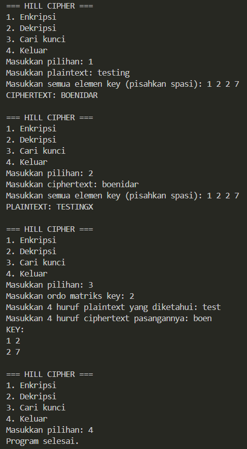

# Hill Cipher

Program ini merupakan implementasi sederhana algoritma **Hill Cipher** menggunakan Python. Program mendukung enkripsi, dekripsi, dan pencarian kunci berdasarkan pasangan plaintext-ciphertext.

## Alur Program

1. Program menampilkan menu utama:
	- **Enkripsi**
	- **Dekripsi**
	- **Cari kunci**
	- **Keluar**
2. Teks diubah menjadi angka berdasarkan alfabet `A=0` sampai `Z=25`. Spasi dihapus dan input hanya boleh berisi huruf `A-Z`.
3. Kunci dimasukkan sebagai matriks persegi. Determinan kunci harus relatif prima dengan 26 agar matriks memiliki invers modulo 26.
4. Pada proses enkripsi atau dekripsi:
	- Teks dibagi menjadi beberapa blok sesuai ukuran matriks kunci.
	- Jika panjang teks belum sesuai ukuran blok, karakter `X` ditambahkan sebagai padding.
	- Setiap blok dikalikan dengan matriks kunci modulo 26.
	- Hasil angka diubah kembali menjadi huruf.
5. Pada dekripsi, program menghitung invers matriks kunci terlebih dahulu, kemudian memproses ciphertext menggunakan invers tersebut.
6. Pada menu **Cari kunci**, program menerima pasangan plaintext dan ciphertext, menghitung invers matriks plaintext, lalu mendapatkan kunci dengan rumus:

	`Kunci = Matriks Ciphertext x Invers Matriks Plaintext (mod 26)`

7. Program terus kembali ke menu sampai pengguna memilih **Keluar**.

## Contoh Output

Contoh berikut memperlihatkan proses enkripsi, dekripsi, pencarian kunci, dan keluar dari program:



Pada contoh tersebut:

- Plaintext `TESTING` dienkripsi menjadi `BOENIDAR` setelah ditambahkan padding `X`.
- Ciphertext `BOENIDAR` berhasil didekripsi kembali menjadi `TESTINGX`.
- Kunci yang ditemukan adalah:

  ```text
  1 2
  2 7
  ```

## Menjalankan Program

Pastikan Python sudah terpasang, lalu jalankan perintah berikut dari folder `pert2`:

```bash
python hillcipher.py
```
