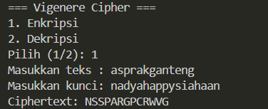
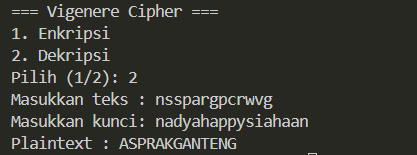

# Vigenere Cipher dan Autokey Cipher

Penjelasan alur kerja dua cipher substitusi polialfabetik. Keduanya menggeser huruf plaintext berdasarkan huruf kunci, tetapi cara membentuk kuncinya berbeda.

## Dasar Perhitungan

Huruf diubah menjadi angka: A=0, B=1, ..., Z=25.

- Enkripsi: `C = (P + K) mod 26`
- Dekripsi: `P = (C - K) mod 26`

Keterangan: `P` = plaintext, `K` = kunci, `C` = ciphertext.

## Vigenere Cipher

Kunci **diulang** sampai sepanjang plaintext.

### Alur Enkripsi

1. Bersihkan plaintext (ambil huruf saja, ubah ke huruf besar).
2. Ulang kunci sampai panjangnya sama dengan plaintext (dipotong jika lebih panjang).
3. Ubah huruf plaintext dan kunci ke angka.
4. Jumlahkan tiap pasangan, lalu `mod 26`.
5. Ubah hasilnya kembali ke huruf.

### Contoh Enkripsi Soal 1

Plaintext `ASPRAKGANTENG`, kunci `NADYAHAPPYSIAHAAN`. Karena karakter kunci < plain text, maka kunci yang dipakai dipotong sepanjang karakter plain menjadi `NADYAHAPPYSIA`.

| Pt | n(Pt) | K | n(K) | (P + K) mod 26 | C |
|---|---|---|---|---|---|
| A | 0 | N | 13 | 13 | N |
| S | 18 | A | 0 | 18 | S |
| P | 15 | D | 3 | 18 | S |
| R | 17 | Y | 24 |15 | P |
| A | 0 | A | 0 | 0 | A |
| K | 10 | H | 7 | 17 | R |
| G | 6 | A | 0 | 6 | G |
| A | 0 | P | 15 | 15 | P |
| N | 13 | P | 15 | 2 | C |
| T | 19 | Y | 24 | 17 | R |
| E | 4 | S | 4 | 22 | W |
| N | 13 | I | 8 | 21 | V |
| G | 6 | A | 0 | 6 | G |

Ciphertext: `NSSPARGPCRWVG`

### Alur Dekripsi

1. Ulang kunci sepanjang ciphertext.
2. Kurangkan angka ciphertext dengan angka kunci, lalu `mod 26`.
3. Ubah hasilnya kembali ke huruf.

Kunci sudah diketahui sejak awal, jadi seluruh ciphertext bisa didekripsi sekaligus.

## Autokey Cipher

Kunci awal **dilanjutkan dengan plaintext itu sendiri**, tanpa diulang.

### Alur Enkripsi

1. Bersihkan plaintext.
2. Susun kunci: kunci awal + plaintext, dipotong sepanjang plaintext.
3. Ubah huruf plaintext dan kunci ke angka.
4. Jumlahkan tiap pasangan, lalu `mod 26`.
5. Ubah hasilnya kembali ke huruf.


### Alur Dekripsi

Dilakukan **bertahap**, karena kunci berikutnya berasal dari plaintext yang baru didekripsi.

1. Dekripsi huruf pertama sebanyak panjang kunci awal memakai kunci awal.
2. Plaintext hasilnya dipakai sebagai kunci untuk huruf ciphertext berikutnya.
3. Ulangi sampai seluruh ciphertext selesai.


## Kasus Kunci Lebih Panjang dari Plaintext

Kunci **dipotong** sepanjang plaintext, dan sisanya tidak dipakai. Pada kasus ini Vigenere dan Autokey menghasilkan ciphertext yang **sama**.

### NOTE
Karena pada kasus soal 1 (asprakganteng) dengan key (nadyahappysiahaan) key-nya dipotong sepanjjanag plain text, maka hasil dari autokey dan vigenere akan sama persis

## Menjalankan Program

File Python yang disediakan saat ini mengimplementasikan **vigenere**.

```bash
python vigenerecipher.py
```

Pilih `1` untuk enkripsi atau `2` untuk dekripsi, lalu masukkan teks dan kunci. Spasi dan simbol dibuang, dan semua huruf diubah ke huruf besar.

## Output program

